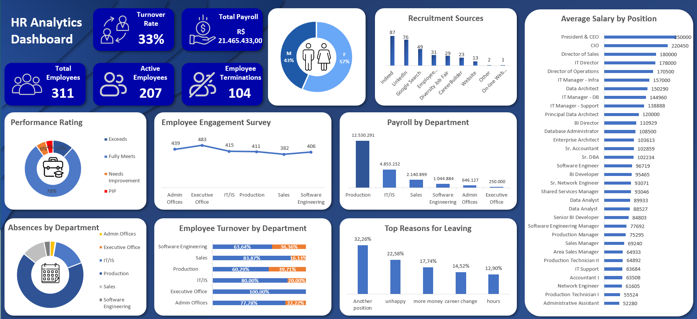

# HR Analytics Dashboard — Excel

Interactive Human Resources dashboard developed in Microsoft Excel to analyze employee demographics, salaries, performance, absences, training, engagement, and employee turnover.

## Project Overview

This project was developed as part of my data analytics portfolio using the HRDataset_v14 dataset.

The main objective was to transform raw Human Resources data into an interactive dashboard that provides a clear overview of the organization's workforce and helps identify important HR trends and patterns.

The dashboard brings together different employee indicators into a single analytical view, making it easier to monitor workforce composition, employee status, performance, compensation, attendance, training, and turnover.

## Tools & Technologies

* Microsoft Excel
* Power Query
* Pivot Tables
* Pivot Charts
* Data Cleaning & Transformation
* Data Analysis
* Data Visualization
* Interactive Dashboard

## Dataset

The project uses the HRDataset_v14 dataset, containing employee-related information such as:

* Employee demographics
* Gender
* Department
* Position
* Salary
* Recruitment source
* Performance rating
* Employee status
* Termination information
* Absences
* Engagement survey results
* Training information
* Employee satisfaction
* Hiring and termination dates

## Dashboard

### Key Metrics & Analysis

The dashboard provides insights into several Human Resources indicators, including:

* Total Employees
* Active Employees
* Terminated Employees
* Employee Gender Distribution
* Salary Expenses by Department
* Employee Performance
* Absences by Department
* Training and Development
* Employee Engagement
* Employee Turnover
* Recruitment Sources
* Termination Reasons
* Department Analysis

## Key Questions

The dashboard was designed to help answer questions such as:

* How many employees are currently active?
* How many employees have been terminated?
* How is the workforce distributed by gender?
* Which departments have the highest salary expenses?
* Which departments have the highest number of absences?
* How is employee performance distributed?
* Which recruitment sources generate the most employees?
* What are the main reasons for employee termination?
* How does employee engagement vary across the organization?
* Which departments have higher turnover?
* How does training relate to employee development?

## Business Objective

The purpose of this dashboard is to transform HR data into actionable information that can support data-driven decision-making.

By consolidating workforce, compensation, performance, attendance, training, engagement, and turnover indicators, the dashboard allows HR teams and decision-makers to identify patterns and potential areas for improvement.

## Project Structure

hr-dashboard-excel/
│
├── README.md
│
├── dashboard/
│   └── Dashboard - RH.xlsx
│
├── data/
│   └── HRDataset_v14.csv
│
└── images/
    └── dashboard-preview.png

## How to Use

1. Download the Excel file from the `dashboard` folder.
2. Open the file using Microsoft Excel.
3. Enable editing/content if requested.
4. Use the available filters and interactive elements to explore the dashboard.
5. Navigate through the different HR indicators and visualizations.

## Skills Demonstrated

This project demonstrates practical skills in:

* Data cleaning
* Data transformation
* Data analysis
* HR Analytics
* KPI development
* Data visualization
* Pivot Tables
* Interactive dashboards
* Business Intelligence
* Data storytelling
* Microsoft Excel

## Key Takeaways

This project demonstrates how raw Human Resources data can be transformed into an interactive analytical tool capable of providing a broader understanding of workforce performance and organizational trends.

The dashboard emphasizes the importance of combining multiple HR indicators rather than analyzing employee data in isolation.

## Author

Dalto Duarte

This project was developed as part of my data analytics portfolio, with a focus on developing practical skills in data analysis, business intelligence, and dashboard development.
